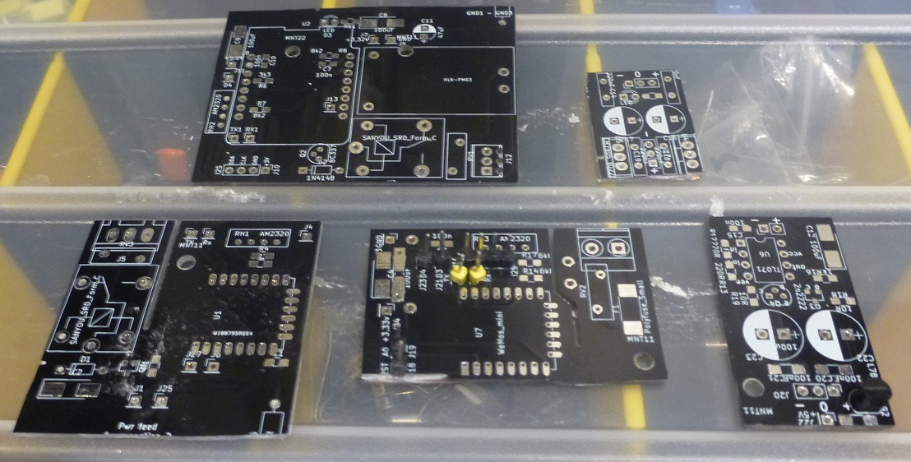

# KicadBerkerPower2
Black board

# Mix project
The board consists of 5 separate sections that can be separated. On the backside its easy to see the different ground planes and where to cut the board if needed.

## Status - Rev A Produced
### Errata

### Issues and Notes
*The two ESP12 modules are difficult to program

*The Wemos D1 mini section should not be used for 230V but works nevertheless.

*The rest is fine.

## Physical Construction

## Features

# Details
## Wemos D1 mini - section 1
Section 1 is the largest section on the board. It is intended as a development board for section 2 and 3.
Section 1 has an AM2320, a relay and a power supply. Besides this it has breakout of several pins and an LED for debug/information.
### Issues
There is one flaw with section 1 that should be addressed: The pins on the power connector are too close for 230V operation as the centerpin of the relay bridges the live and neutral (calculated to be min 2,3mm between open terminals - 3,2mm for certification) 

### I2S connector 
D1 - SCL

D2 - SDA
### AM2320 
D1 - SCL

D2 - SDA
### Relay
D3 - Active high
### HLK-PM03 PSU
+3v PSU supply if mounted 
Connector not suitable for 230V
Protection: Varistor
External Fuse needed
### Pull down LED
D8 - active low
## ESP12S - Section 2
Section 2 is the smaller than section 1 but with most features of it.
### AM2320 
### Relay
### HLK-PM03 PSU
## ESP12S - Section 3
No reset or programming assistance (pulldn/up etc)
Programming via Rx/Tx (or preprogrammed)
### AM2320 
### Relay
### HLK-PM03 PSU
## PSU - Virtual GDN - "Floating ground section"
Sometimes you only have a single ended supply but need a positive and negative supply.
This little board provides a low power balanced center that can be used as GND. So a +24 V single ended supply becomes a +/-12V supply.

### Input +/- supply
eg +24Vin and a "GNDin"
### Output + 0 - supply
becomes a +12V (same as +24in) GND and -12V (same as GNDin)
### Output regulated +5v GND (78L05)
The +12Vout is fed to a low power regulator for 5V output
## PSU
### Input + 0 - supply
### Output + 0 - regulated supply (78xx and 79xx)

#Cutout

