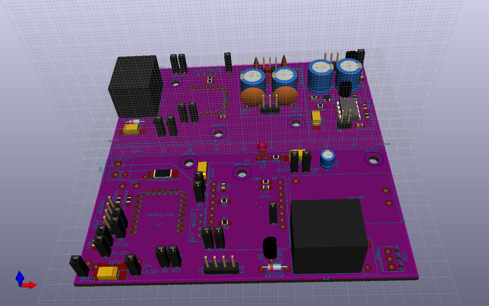

# KicadBerkerPower2
Black board

# Mix project
## Wemos D1 mini - section 1
### I2S connector 
D1, D2
### AM2320 
D1, D2
### Relay
D3
### HLK-PM03 PSU
+3v PSU
### Pull down LED
D8
## ESP12S - Section 2
### AM2320 
### Relay
### HLK-PM03 PSU
## ESP12S - Section 3
### AM2320 
### Relay
### HLK-PM03 PSU
## PSU - Virtual GDN - "Floating ground section"
### Input +/- supply
### Output + 0 - supply
### Output regulated +5v GND (78L05)
## PSU
### Input + 0 - supply
### Output + 0 - regulated supply (78xx and 79xx)
